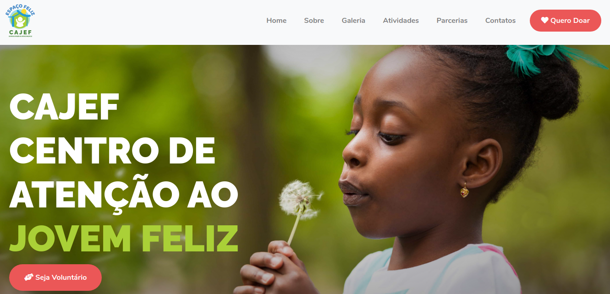

# CAJEF - CENTRO DE ATENÇÃO AO JOVEM FELIZ

<h1 align="center">
   
</h1>  

## 📝 Sobre este projeto

O Centro de Atenção ao Jovem Espaço Feliz (CAJEF) é uma organização não governamental (ONG) sem fins lucrativos que visa incentivar a cidadania e a vivência de bons valores para crianças e adolescentes. Atendemos mais de 100 crianças de 3 a 14 anos de Cabo Frio (RJ) em situação de vulnerabilidade social, promovendo a eles atividades educativas, esportivas e culturais para potencializar seus talentos.

Nosso trabalho também tem como objetivo a inserção e permanência dos jovens no mercado de trabalho.


## 🧩 Funcionalidades
1. A página conta com 2  pop-ups. Cada pop-up possui um formulário diferente. Um para cadastrar contatos para doações e o outro para cadastrar voluntários para a ong. Os dados de ambos os formulários são enviados diretamente para o email da ong.
2. A página também possui uma galeria, separada por abas, com diferente atividades realizadas pela ong.

## 📁 Como baixar o projeto

````
# Clonar o repositório
$ git clone https://github.com/cajef/website

# Entrar no diretório
$ cd website
````

## Sobre o desenvolvimento projeto 

### 🚀 Bibliotecas:
- **smtp.js** para o envio de e-mails
- **boostrap** para a estilização responsiva da página
- **fonteawesome** para a importação de ícones
- **jquery** para o funcionamento da navbar, embutido 
- **google tag manager** para a futura adição de diversos recursos de marketing digital

## Sobre a equipe de desenvolvimento
- **Walter** 
  - responsável pelo envio de e-mails
  - estruturação do site
  - aplicação "crua" do design
  
- **Elisabeth**
  - responsável por tornar o design responsivo
  - trabalhar mais profundamente no design
  - mudanças necessárias na página ao longo do projeto
  
- **Sílvia**
  - responsável pela organização do projeto
  - pelo relatório e documentação do projeto
  - mudanças necessárias na página ao longo do projeto
